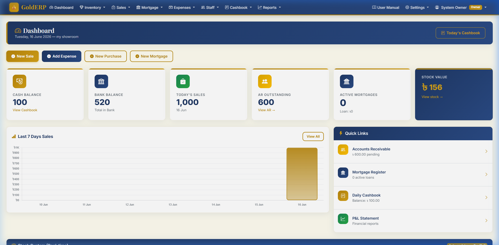
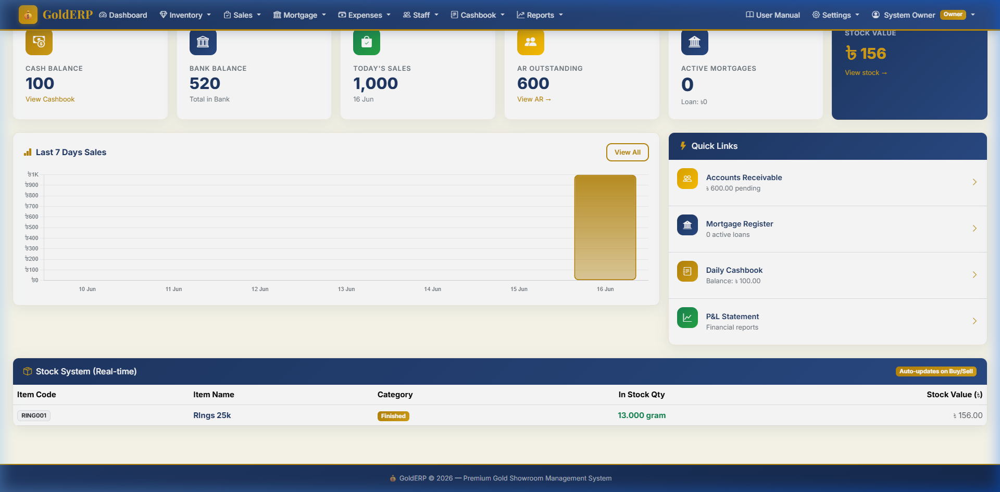

# 🏆 Gold Seller Management System (GoldERP)

A premium, full-stack **Accounting & Inventory Management System** designed specifically for Gold Showrooms. Built with Python (Flask), SQLAlchemy, and Bootstrap 5, it features a beautiful, luxurious UI and handles everything from sales, purchases, mortgage (loan), automated cashbook posting, financial reporting, and role-based access control.

---

## ✨ Features

- **Automated Cashbook:** Sales and expenses are automatically posted to the daily cashbook.
- **Stock Management (Real-time):** Tracks all gold items (finished/raw). Buying adds to stock, selling reduces stock automatically. Calculates weighted average Cost of Goods Sold (COGS).
- **Mortgage (Loan) Register:** Keep track of gold given as security, calculate monthly interest, and manage redemptions.
- **Accounts Receivable:** Track pending customer dues and receive partial payments against invoices.
- **Financial Reports:** Auto-generated **Profit & Loss (P&L)** statement, **Balance Sheet**, and **Cashflow Statement**.
- **Role-Based Access (RBAC):** Separate permissions for `Owner`, `Manager`, and `Staff`. Managers cannot delete records, staff cannot view sensitive financial reports.
- **Responsive UI:** A stunning, mobile-friendly design with a navy-blue, gold, and cream color palette.
- **User Manual:** Built-in Bengali user manual (`/manual`) explaining how to use the software.

---

## 📸 Screenshots

### 1. Dashboard & KPIs

*Shows real-time Cash Balance, Bank Balance, Today's Sales, Active Mortgages, and a beautiful 7-day sales chart.*

### 2. Real-time Stock System

*Live tracking of all gold inventory with current stock quantities and total valuation.*

---

## 🚀 Installation Guide

### Prerequisites
- Python 3.10+
- Git

### Step 1: Clone the repository
```bash
git clone https://github.com/pythonicshariful/GoldERP.git
cd GoldERP
```

### Step 2: Create a Virtual Environment
```bash
python -m venv venv
```

**Activate the virtual environment:**
- On Windows:
  ```bash
  venv\Scripts\activate
  ```
- On macOS/Linux:
  ```bash
  source venv/bin/activate
  ```

### Step 3: Install Dependencies
```bash
pip install -r requirements.txt
```

### Step 4: Configure the Environment Variables
Copy `.env.example` to `.env` and update the secret key (optional for local dev):
```bash
copy .env.example .env   # On Windows
cp .env.example .env     # On macOS/Linux
```

### Step 5: Run the Application
The application uses SQLite by default. Tables and default settings are created automatically upon the first run!
```bash
python run.py
```
*The server will start on `http://127.0.0.1:5000`*

---

## 🔑 Usage & Default Credentials

Upon running the app for the very first time, a default **Owner** account is automatically seeded into the database.

**Login URL:** `http://127.0.0.1:5000/login`

- **Username:** `admin`
- **Password:** `admin123`

### Next Steps After Login:
1. Go to **Showroom Setup** to configure your shop's name, address, and rental details.
2. Go to **Inventory > Item Master** to add the types of gold you sell (e.g., Ring 22K, Chain 21K).
3. Go to **User Management** to create accounts for your staff or managers.
